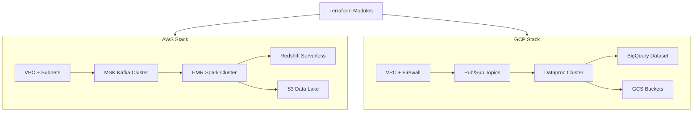

# Terraform IaC — Cloud Data Engineering Infrastructure


Infrastructure as Code for provisioning complete data engineering environments on AWS and GCP using Terraform. Covers VPC, compute, managed Kafka, data warehouses, storage buckets, and IAM — reproducible in minutes.

## Architecture



## Modules

| Module | Cloud | Description |
|--------|-------|-------------|
| `modules/aws/networking` | AWS | VPC, subnets, security groups |
| `modules/aws/msk` | AWS | Managed Kafka (MSK) cluster |
| `modules/aws/emr` | AWS | Spark cluster with autoscaling |
| `modules/aws/redshift` | AWS | Redshift Serverless namespace |
| `modules/aws/s3-datalake` | AWS | S3 data lake with lifecycle policies |
| `modules/gcp/networking` | GCP | VPC, firewall rules |
| `modules/gcp/dataproc` | GCP | Dataproc Spark cluster |
| `modules/gcp/bigquery` | GCP | BigQuery datasets + tables |
| `modules/gcp/gcs` | GCP | GCS buckets with IAM bindings |

## Prerequisites

- Terraform >= 1.5
- AWS CLI configured (for AWS modules)
- gcloud CLI configured (for GCP modules)

## Quick Start

```bash
git clone https://github.com/zulham-tech/terraform-cloud-iac.git
cd terraform-cloud-iac
cd environments/aws-dev
terraform init && terraform plan && terraform apply
```

## Project Structure

```
.
├── modules/
│   ├── aws/
│   │   ├── networking/
│   │   ├── msk/
│   │   ├── emr/
│   │   ├── redshift/
│   │   └── s3-datalake/
│   └── gcp/
│       ├── networking/
│       ├── dataproc/
│       ├── bigquery/
│       └── gcs/
├── environments/
│   ├── aws-dev/
│   └── gcp-dev/
├── main.tf
└── variables.tf
```

## Author

**Ahmad Zulham** — [LinkedIn](https://linkedin.com/in/ahmad-zulham-665170279) | [GitHub](https://github.com/zulham-tech)
